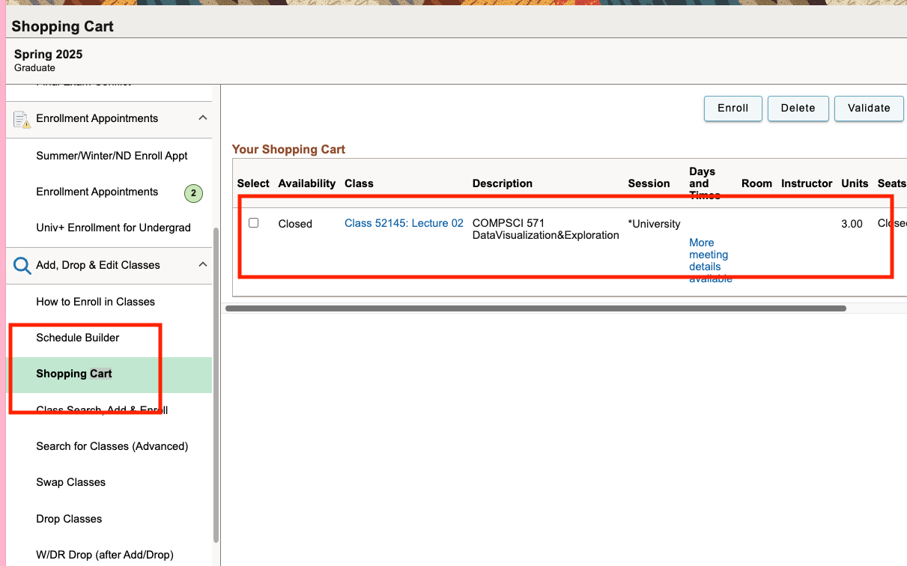
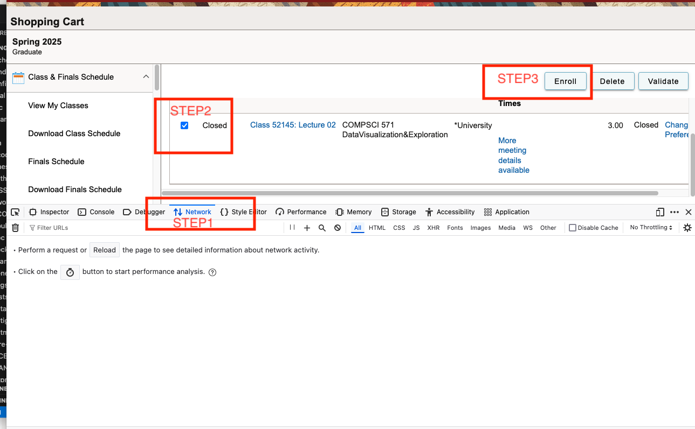
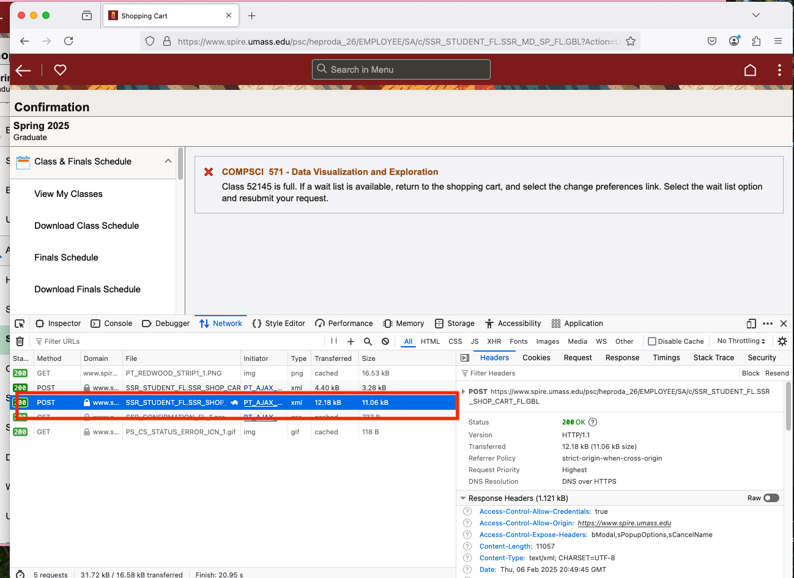
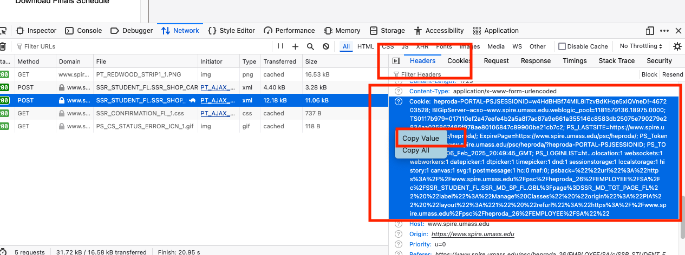
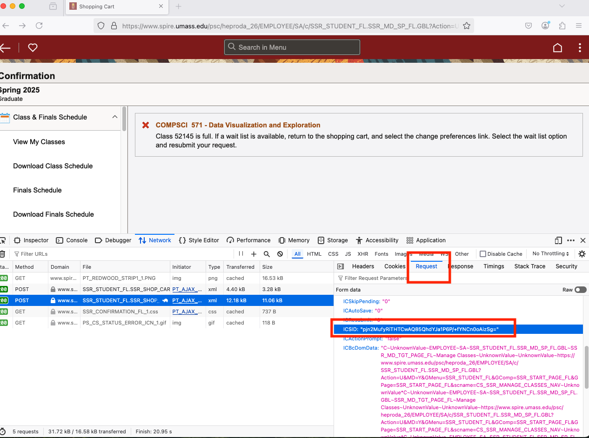

# <center>SPIRE选课工具

## 前言
- 本工具仅作为作者朋友自用，严禁外传。
- 本工具开发并不完整，只是为了省事做的一个小工具。
- 使用中文是为了防止不必要的麻烦
- `session`会过期，一次挂几个小时，每次请求隔十秒

## 介绍
- 原理：伪装你自己直接发POST包给SPIRE服务器提出请求
- 验证机制：关于SPIRE的验证需要三个东西
> - - `ICSID`(在POST包的`payload`里，每个`session`保持不变)
> - - `ICStateNum`(及其简单的验证，初始访问的时候赋予一个整数值，随后每次访问页面+1)
> - - `Cookie`(验证你的身份)

- 你需要做什么：
> - - 1.配置好一个极其简单的python环境用于发包
> - - 2.登入你的`spire`账户，把你想选的课加到购物车里
> - - 3.按f12进入开发者工具，获取`Payload`里的`ICStateNum`和`Cookie`(后面会有详细截图步骤)

## 使用


### 教学视频链接
https://drive.google.com/file/d/1C9X57COc0CT9tKQa2yk9pHTBVcz3h7Vk/view?usp=drive_link

### 配置python环境
```bash
pip install -r requirements.txt
```

### (建议使用firefox浏览器)登录SPIRE选课系统并且到达购物车页面，加入你想选的课程到购物车里，此时课程的状态是Closed。


### 按下F12，选择上方的Network窗口，勾选你的课程并且点击Enroll按钮，点击Yes

### 此时你的Network里应该有两个POST包，选择那个更大的12kb的包

### 找到这个包的Header里，Request Header，Cookie，右键点击复制value，粘贴进`run.sh`

### 同样，找到这个包的Request里ICSID，右键点击复制value，粘贴进`run.sh`



### 运行`run.sh`，如果终端打印Success，说明启动成功
```bash 
bash run.sh
```

## 补充
- spire的验证方式还是非常原始的，理论上除了登录需要SMS验证非常麻烦以外，其他的手动重复操作都是可以脚本执行的
- 关于如何做这个脚本，需要用浏览器的开发者模式重复发包，观察消息头和payload里面有多少验证方式，以及如何变换的，中间可能涉及到一些加密方式
- This Tool is Just for Fun, 如有侵权我会删除repo